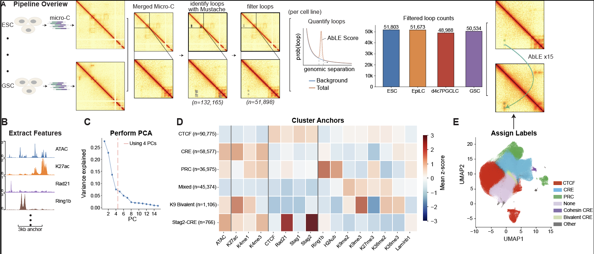

# loop_analyses
Code for manuscript on anchor clustering, loop strength prediction

Pipeline overview from since updated paper figure:


- Merge the 4 micro-C maps into one using `cooler merge`
- Call loops on this merged micro-C map using `cooler`, call at a permissive strength/FDR
-  Filter loops by
	- size geq 32kb
	- No NaNs near center
	- Sufficient read counts
	- Loop is a local maxima
- Now, call AbLE per cell line
	- If fails or neg or 0 = NaN
- Now I have 4 sets of loops (one per cell line)
	- chr1, s1, e1, chr2, s2, e2, mid1, mid2, cell_line, AbLE
- Extract anchors
	- chr, mid, 1or2, cell_line
- For all anchors, extract features (epigenomics in 3kb window centered on loop)
	- Input normalize each epigenomic feature with $log_2(Signal/Input)$, minus ATAC
	- ATAC
- For all anchors, calculate z-score and decile of each feature
- For each anchor, apply rules:
	- Is CTCF 
		- CTCF: CTCF (narrow) **and** Rad21 (narrow)
	- Is E
		- K4me1 (narrow) **or** K27ac (broad)
	- Is P
		- TSS
	- CRE = E **or** P
	- Is PRC
		- H2Aub **and** Ring1b
- view epigenomic pileups, sankey plot
- Put all the anchors into a long df with cols:
	- chr, mid, 1or2, cell_line, feats
- Clustering:
	- perform PCA on the anchors
	- take 4 components
	- perform KNN clustering
	- view heatmap
	- Condense clusters, new heatmap
- define distance traveled by loops using PCA space
- Now merge across cell lines to calculate distance of loops
- Merge anchors to loops
	- chr1, s1, e1, chr2, s2, e2, mid1, mid2, size, cell_line, a1_feats, a2_feats, AbLE
- Strength prediction: 
	- decile heatmaps, LR on specific features
	- strength size decay plots
	- violin plots
	- Residualize out importance of size
	- per cell line, per loop class models
	- perform PLS on the loops, take 4 components
	- Linear regression on PLS for loop strength
	- Ridge regression for feature importance
- scripts to generate paper figures

*worth noting that due to packge conflicts, a few different conda environments are used throughout these scripts, the corresponding `.yml` files will be in the appropriate folder, and usually called out at top of script with a `#conda activate <env>`*

-- more comprehensive readme generated with AI help--

# loop_analyses

Code for a manuscript on chromatin loop-anchor clustering and loop-strength
prediction across four cell lines in a mouse PGC-specification time course
(**ESC → EpiLC → GSC → d4c7PGCLC**), built on Micro-C data.

At a high level, the pipeline:

1. Calls and quantifies chromatin loops per cell line from merged Micro-C maps.
2. Quantifies epigenomic signal (ATAC, CTCF, histone marks, Rad21/Stag/Ring1b,
   etc.) at every loop anchor and z-scores it.
3. Classifies each anchor as **CTCF**, **CRE** (promoter/enhancer), **PRC**
   (Polycomb), or none, using fixed rules on the epigenomic calls.
4. Clusters anchors (PCA + KNN) and names the resulting clusters.
5. Builds a loop-level table and fits models predicting loop strength
   (`AbLE_score`) from anchor features.
6. Generates the figures used in the manuscript (pileups, heatmaps, Sankeys,
   UMAPs, violin plots, etc.).

## Repository layout

| Folder | What it does |
|---|---|
| `0_helper_scripts/` | Shared plotting/analysis utilities imported by the steps below (Sankey plots, APA pileups, heatmaps, UMAP scatter, CPU limiting, etc.). Not run directly. |
| `1_call_loops/` | Merge the 4 cell-line Micro-C maps, call loops (`mustache`), filter/merge calls, remove blacklisted regions, quantify loop strength (`AbLE`), upload to HiGlass. **Needs both the merged `.mcool` and each individual cell line's `.mcool`** — see callout below. |
| `2_epigenomics/` | Quantify epigenomic signal at loop anchors, z-score it, and classify each anchor as CTCF / CRE / PRC / none. |
| `3_anchor_clustering/` | PCA + KNN clustering of anchors, UMAP visualization, cluster naming, overlap checks against the peak-based classification. Several of its plotting scripts are exploratory re-runs of plots that get regenerated (in final form) in `6_final_figs/` — see callout below. |
| `4_loop_strength_prediction/` | Build the per-loop feature table and fit loop-strength prediction models (per cell line, per loop class). |
| `5_view_examples/` | Spot-check individual loop calls against the Micro-C matrix. Can just run 3, 1 and 2 left for completeness. |
| `6_final_figs/` | Final manuscript figure generation. Includes one UMAP script (`6_anchor_umap.py`) that is *not* in the paper — see callout below. |

Scripts within a folder are numbered in the order they're meant to be run.

### A note on merged vs. per-cell-line `.mcool` files

`1_call_loops/` needs **two different kinds of Micro-C input**, not just one:

- **Loop *calling*** (`1_merge_microc.sh` → `2_call_loops.sh`) is done on a
  single `.mcool` that merges all 4 cell lines together — this gives one
  consistent set of loop positions/anchors to use across every cell line,
  rather than calling loops separately per cell line and having to reconcile
  mismatched anchor sets.
- **Loop *quantification*** (`7_quantify_loops_pl.py`, the `AbLE_score` step)
  is then run separately **per cell line's own individual `.mcool`**
  (`{cell_line}_WT_10B.mcool`), so that each loop gets a cell-line-specific
  strength even though its position came from the merged call set.

So before running step 1, make sure you have on hand: the 4 individual
per-cell-line `.mcool` files (used both to build the merged map and later for
quantification) *and* the merged `.mcool` produced from them (used only for
calling loop positions). Missing the per-cell-line files will break
quantification even if loop calling succeeds.

### Plots in `3_anchor_clustering/` you can skip

A handful of the plotting scripts in `3_anchor_clustering/` (e.g.
`4b_anchor_epi_plots.py`, `5_loop_apas.py`, `2_plot_umap.py`) were exploratory,
and their outputs get recreated — in finalized, manuscript-ready form — by
the corresponding scripts in `6_final_figs/` (`1a_anchor_epi_plots.py`,
`3_apa_pileups.py`, `6_anchor_umap.py`). You don't need to run those `3_`
versions as part of a full pipeline pass; they're left in place for
reference/debugging rather than because their output is still used downstream.
The non-plotting scripts in `3_anchor_clustering/` (clustering, cluster
naming, overlap checks) still need to run, since `4_loop_strength_prediction/`
and `6_final_figs/` depend on their output tables.

**Note:** the anchor UMAP (`6_final_figs/6_anchor_umap.py`, and its
exploratory counterpart `3_anchor_clustering/2_plot_umap.py`) did not end up
in the manuscript. The code is kept here for completeness sake.

## Environments

This project spans several unrelated toolchains (Hi-C/Micro-C tools, deep
learning–style anchor clustering, genome browser plotting, etc.), so there is
**no single environment that runs the whole pipeline** — different steps use
different conda environments. Each environment is checked in as a
`conda env export` next to the step(s) that need it, named `_<env>_env.yml`:

| Env file | Conda env name | Used by |
|---|---|---|
| `1_call_loops/_mustache_env.yml` | `mustache` | `1_call_loops/2_call_loops.sh` (loop calling) |
| `1_call_loops/_loop_quant_env.yml` | `loop_quant_env` | `1_call_loops/4_Ps_curves.py`, `5_filter_loops.py`, `7_quantify_loops*.{sh,py}` |
| `1_call_loops/_higlass_env.yml` | `higlass_env` | `1_call_loops/8_upload_bedpes.sh` |
| `2_epigenomics/_bigwig_env.yml` | `bigwig` | `2_epigenomics/1_epigenomics.sh`, `1_quantify_epigenomics.py` |
| `2_epigenomics/_pybedtools_env.yml` | `pybedtools_env` | `2_epigenomics/3_classify_anchors.py` |
| `3_anchor_clustering/_umap_env.yml` | `umap_env` | all of `3_anchor_clustering/`, all of `4_loop_strength_prediction/`, and `6_final_figs/6_anchor_umap.py` |
| `5_view_examples/_coolbox_env.yml`* | `coolpuppy_env` | all of `5_view_examples/`, and all of `6_final_figs/` |

Each script/shell file notes which env it expects in a `# conda activate
<env>` comment near the top — check there if you're unsure.

### Setting up an environment

From the repo root (or wherever is convenient):

```bash
conda env create -f 1_call_loops/_loop_quant_env.yml
conda activate loop_quant_env
```

### Which environment do I need?

As a rule of thumb, walk folders `1` → `6` in order and switch environments
whenever you cross into a new numbered folder (`3_anchor_clustering/` and
`4_loop_strength_prediction/` both use `umap_env`, so no switch needed between
those two). `0_helper_scripts/` isn't run directly — it's imported by scripts
in `3_anchor_clustering/` and `4_loop_strength_prediction/`, so it runs under
whatever env you're already in (`umap_env`) rather than needing its own.